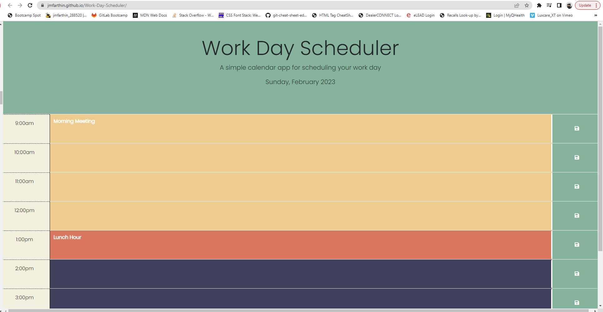
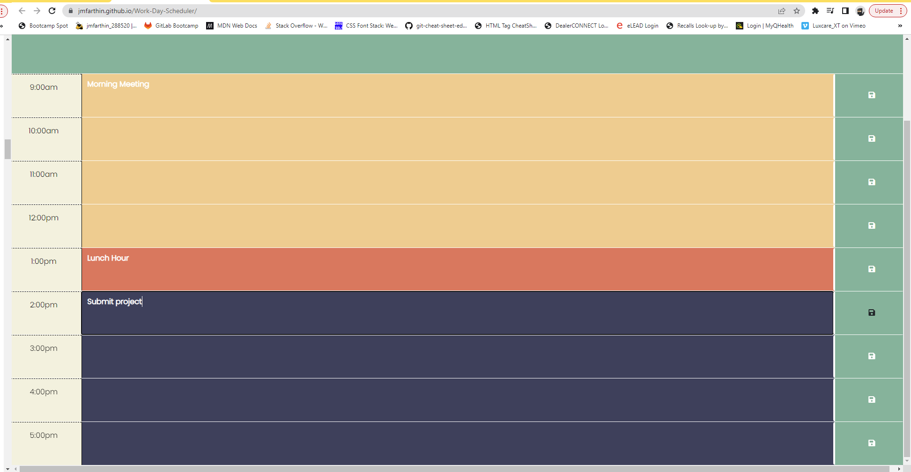

# Work-Day-Scheduler

## Description

This project is a daily planner that highlights what hours/tasks are in the past, what hour/task it is currently, and which hours/tasks are in the future. It's purpose is to showcase my current knowledge of javascript and highlight certain proficiencies such as:

- third party APIs such as dayjs
- jquery
- event listeners
- local storage
- google fonts

## Usage

To view the Work-Day Scheduler website, visit: https://jmfarthin.github.io/Work-Day-Scheduler/

Repository: https://github.com/jmfarthin/Work-Day-Scheduler.git

This planner's date is updated daily using dayjs. After a user enter's a task in to a time block, they can then click the save button to save the task to that time block. After the hour of a particular task has passed the background color of that time block will change to indicate the time passage to the user.

### Screenshots of deployed website:

## Credits

Georgeyoo
mfyke
cmathena2U

## License

Licensed under the general usage MIT license.
Copyright (c) 2023 Justin Farthing